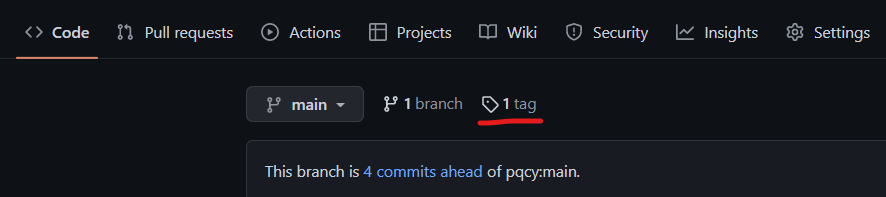

pqc-vpn
===

## Build

### clone
git clone https://gitlab.com/gilgil/g.git  
git clone https://gitlab.com/gilgil/pqc-vpn.git or git clone https://github.com/pqcy/pqc-vpn.git

### Buid G library
cd g  
cd lib  
make libg  
cd ../..  

### Buid pqc-vpn library and apps
cd pqc-vpn  
cd lib  
qmake  
make -j$(NPROC)  
cd ../app  
qmake  
make -j$(NPROC)  
cd ../..  

## Run

### Server
sudo ./vpnserver-test 12345 crt/rootCA.pem eth0  

### Client
sudo ./start.sh  
sudo ./vpnclient-test dum0 00:00:00:11:11:11 wlan0 127.0.0.1 12345  

MAC 주소는 테스트 당시 임의로 줬다   

종료시   
sudo pkill vpnclient-test   
sudo ./stop.sh  

## release로 빌드없이 바로 Run   

tag 버튼을 눌러 pqc-vpn-v0.0.0.6.tar.gz 을 다운로드 받아 압축을 풀면 빌드과정을 거칠 필요없이 바로 Run 부분을 실행하면 된다.   

v0.0.0.6 으로 들어가서 다운로드 하면 된다.   

## tag 와 release에 대한 개념 참고 사이트   

https://webisfree.com/2017-07-31/git-%ED%83%9C%EA%B9%85%ED%95%98%EA%B8%B0-tag-%EC%82%AC%EC%9A%A9%ED%95%98%EA%B8%B0   

https://git.jiny.dev/gitflow/release   

https://hbase.tistory.com/62
